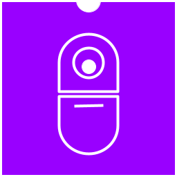
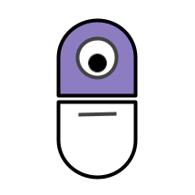
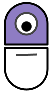

<!--

-->

# Capsule: the nano (wasm) functions runner

- 🖐 Issues: [https://github.com/bots-garden/capsule/issues](https://github.com/bots-garden/capsule/issues)
- 📦 Last release: `v0.3.2 🤗 [WASM I/O 2023]`
- 📦 Next release: `v0.3.3 TBD` *🚧 in progress*
- 📝 Full documentation [https://bots-garden.github.io/capsule/](https://bots-garden.github.io/capsule/)

## What is **Capsule**?

**Capsule** is a WebAssembly function launcher(runner). It means that, with **Capsule** you can:

- From your terminal, execute a function of a wasm module (the **"CLI mode"**)
- Serving a function of a wasm module through http (the **"HTTP mode"**)
- Serving a function of a wasm module through NATS (the **"NATS mode"**), in this case **Capsule** is used as a NATS subscriber and can reply on a subject(topic)
- Serving a function of a wasm module through MQTT (the **"MQTT mode"**), in this case **Capsule** is used as a MQTT subscriber and can reply on a subject(topic)

> - **Capsule** is developed with GoLang and thanks to the 💜 **[Wazero](https://github.com/tetratelabs/wazero)** project
> - The wasm modules are developed in GoLang and compiled with TinyGo (with the WASI specification)

