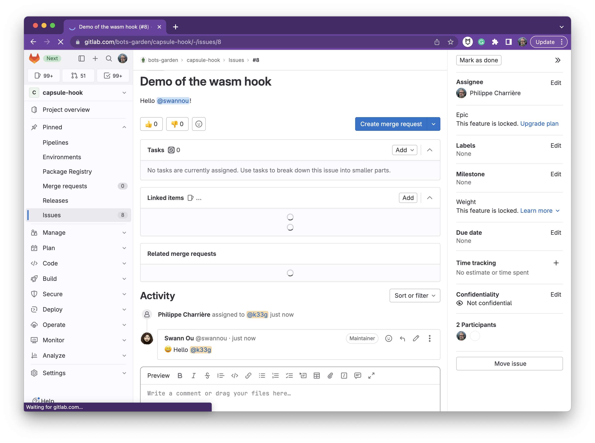

# Use the GitLab WebHook sample

This sample is a [webhook for a GitLab project](https://docs.gitlab.com/ee/user/project/integrations/webhooks.html) created with Capsule HTTP. For my tests, I use [Ngrok](https://ngrok.com/), so, I can host locally the webhook.

This webhook is listening for the [issue events](https://docs.gitlab.com/ee/user/project/integrations/webhook_events.html#issue-events) and [notes events](https://docs.gitlab.com/ee/user/project/integrations/webhook_events.html#comment-events) of GitLab, and post an answer when it is triggered.

## Compile the webhook

```bash
tinygo build -o glwebhook.wasm \
    -scheduler=none \
    --no-debug \
    -target wasi ./main.go    
```

## Start the webhook

To start this webhook, you need:

- The latest version of Capsule HTTP
- A Ngrok account (with a [AuthToken](https://dashboard.ngrok.com/get-started/your-authtoken))
- A GitLab account (with a [personal access token](https://docs.gitlab.com/ee/user/profile/personal_access_tokens.html))
- A GitLab project (the GitLab account need to be a member of this project)

If you use a **Ngrok domain** (with a paid account: it means that you can provide a fixed url), start the webhook like this:

```bash
WEBHOOK_TOKEN="ilovepanda" \
GITLAB_API_URL="https://gitlab.com/api/v4" \
GITLAB_BOT_TOKEN="your-personal-access-token" \
GITLAB_BOT_NAME="the-gitlab-handle-of-the-user" \
NGROK_DOMAIN="your-ngrok-domain for example: capsule.ngrok.dev" \
NGROK_AUTHTOKEN="your-ngrok-auth-token" \
./capsule-http \
--wasm=./glwebhook.wasm --httpPort=8090
```

If you use the free plan of **Ngrok** (but you will need to change the url of the webhook at every tests), start the webhook like this (without the `NGROK_DOMAIN`):

```bash
WEBHOOK_TOKEN="ilovepanda" \
GITLAB_API_URL="https://gitlab.com/api/v4" \
GITLAB_BOT_TOKEN="your-personal-access-token" \
GITLAB_BOT_NAME="the-gitlab-handle-of-the-user" \
NGROK_AUTHTOKEN="your-ngrok-auth-token" \
./capsule-http \
--wasm=./glwebhook.wasm --httpPort=8090
```

> **Remarks**: 
> - For the both cases, Capsule HTTP will generate a file (`ngrok.url`), so you can easyly retrieve the URL of the ngrok endpoint.
> - You need `WEBHOOK_TOKEN` only if you provided a **Secret token** when you created the webhook, then you will be able to check the token from the header of the query.

## Create the webhook

In your GitLab project, go to **Settings/Webhooks** and create a webhook with the relevant data:


## Use the webhook

### Create an issue

Got to your project and create an issue and notify your bot with its handle into the body of the issue:


Then you can read the answer from the bot:



### Add a comment to the issue

Add a comment to the issue and notify your bot with its handle into the body of the comment:


> **Don't be surprised**: The delay of the comment answer is longer than the one of the issue creation