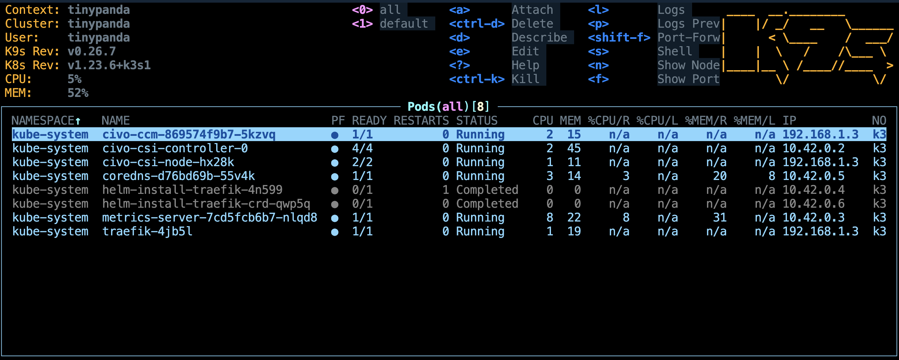

# 🥘 CookBook

## Deploy a Capsule function on Civo

!!! info "What is Civo?"
    **Civo** is a cloud native service provider. They are doing K3S as a service and the UX is just amazing 😍

### Requirements

First, you need an account on **[Civo](https://www.civo.com/)**, then you will need to install some tools.

> The install commands I used were tested on macOs and Ubuntu. I'm using **[brew](https://brew.sh/)**, but there are severeal other ways to install all the needed tools.

- **[kubectl](https://kubernetes.io/docs/tasks/tools/#kubectl)**:
  ```bash
  brew install kubernetes-cli
  ```
- **[Civo CLI](https://www.civo.com/docs/cli)**:
  ```bash
  brew tap civo/tools
  brew install civo
  ```
- **[K9s](https://k9scli.io/)**: *(optional, but K9s is a great tool, very useful to manage your cluster)*
  ```bash
  brew install derailed/k9s/k9s
  ```

## Create a K3s cluster on Civo

In order to use the **Civo CLI** you will need to authenticate yourself to the Civo API using a key. You can find the key or regenerate a new one at [https://www.civo.com/api](https://www.civo.com/api).

Save your key in an environment variable: `CIVO_API_KEY`. And then use the below commands to create a cluster on Civo:

```bash
CLUSTER_NAME="tinypanda"
CLUSTER_SIZE="g4s.kube.xsmall"
CLUSTER_NODES=1
CLUSTER_REGION="FRA1"

mkdir -p config
export KUBECONFIG=$PWD/config/k3s.yaml

# Add the key to the CLI tool
civo apikey add civo-key ${CIVO_API_KEY}
civo apikey current civo-key

# Create the cluster
civo kubernetes create ${CLUSTER_NAME} \
--size=${CLUSTER_SIZE} \
--nodes=${CLUSTER_NODES} \
--region=${CLUSTER_REGION} \
--wait

# Get the kubernetes config file
civo --region=${CLUSTER_REGION} \
kubernetes config ${CLUSTER_NAME} > ./config/k3s.yaml
```

**Output**:
```bash
Saved the API Key civo-key
Set the default API Key to be civo-key
Creating a 1 node k3s cluster of g4s.kube.xsmall instances called tinypanda...

The cluster tinypanda (af4abac9-6fff-463d-b89d-dfc51cdf3333)
has been created in 1 min 10 sec
```

## Look at your cluster

You can use **K9s** to check your new cluster with the below commands:

```bash
export KUBECONFIG=$PWD/config/k3s.yaml
k9s --all-namespaces
```



## Create a new Capsule function

*hello.go*:
```golang
package main

import (
	hf "github.com/bots-garden/capsule/capsulemodule/hostfunctions"
	"github.com/tidwall/gjson"
	"github.com/tidwall/sjson"
)

func main() {
	hf.SetHandleHttp(Handle)
}

func Handle(request hf.Request) (response hf.Response, errResp error) {

	name := gjson.Get(request.Body, "name")

	headersResp := map[string]string{
		"Content-Type": "application/json; charset=utf-8",
	}

	jsondoc := `{"message": ""}`
	jsondoc, _ = sjson.Set(jsondoc, "message", "👋 hello " + name.Str)

	return hf.Response{Body: jsondoc, Headers: headersResp}, nil
}

```

*go.mod*:
```text
module hello

go 1.18
```

## Dockerize the function

*Dockerfile*:
```dockerfile
FROM k33g/capsule-builder:0.0.3
COPY go.mod ./
COPY hello.go ./
RUN  go get -u ./...; go mod tidy;
RUN tinygo build -o hello.wasm -target wasi hello.go

FROM k33g/capsule-launcher:0.2.9
COPY --from=0 /home/function/hello.wasm ./
EXPOSE 8080
CMD ["/capsule", "-wasm=./hello.wasm", "-mode=http", "-httpPort=8080"]
```
> We use [multi-stage](https://docs.docker.com/build/building/multi-stage/) builds to first build the wasm function and then to create the smallest image as possible to serve the function.

### Build and push the Docker image to the Docker Hub

*Build the image:*
```bash
IMAGE_NAME="capsule-hello"
IMAGE_TAG="0.0.0"

docker login -u ${DOCKER_USER} -p ${DOCKER_PWD}
docker build -t ${IMAGE_NAME} .

docker images | grep ${IMAGE_NAME}
```

*Push to the Docker hub:*
```bash
IMAGE_NAME="capsule-hello"
IMAGE_TAG="0.0.0"

docker tag ${IMAGE_NAME} ${DOCKER_USER}/${IMAGE_NAME}:${IMAGE_TAG}
docker push ${DOCKER_USER}/${IMAGE_NAME}:${IMAGE_TAG}
```

### Test the image

```bash
IMAGE_NAME="capsule-hello"
IMAGE_TAG="0.0.0"
docker run -p 8080:8080 --rm ${DOCKER_USER}/${IMAGE_NAME}:${IMAGE_TAG}
```

**Output**:
```bash
💊 Capsule ( v0.2.9 🦜 [parrot] ) http server is listening on: 8080 🌍
```

**Test your deployed function**:
```bash
curl -v -X POST http://localhost:8080 \
-H 'content-type: application/json' \
-d '{"name": "Bob"}'
```

**Output**:
```bash
{"message":"👋 hello Bob"}
```

## Create the manifest to deploy the function

### Some information

Before creating the manifest we need some information:

```bash
CLUSTER_NAME="tinypanda"
CLUSTER_REGION="FRA1"

civo --region=${CLUSTER_REGION} kubernetes show ${CLUSTER_NAME}
```

**Output**:
```bash
                    ID : af4abac9-6fff-463d-b89d-dfc51cdf3333
                  Name : tinypanda
                Region : FRA1
                 Nodes : 1
                  Size : g4s.kube.xsmall
                Status : ACTIVE
              Firewall : k3s-cluster-tinypanda-a39c-dce40a
               Version : 1.23.6-k3s1
          API Endpoint : https://74.220.24.41:6443
           External IP : 74.220.24.41
          DNS A record : af4abac9-6fff-463d-b89d-dfc51cdf3333.k8s.civo.com
Installed Applications : metrics-server, Traefik-v2-nodeport
```

🖐 **save this information somewhere**: `DNS A record : af4abac9-6fff-463d-b89d-dfc51cdf3333.k8s.civo.com`, you will use it to the `host` value of the `Ingress` section of the manifest. The name of our application will be `capsule-hello`, then url to reach it will be `capsule-hello.af4abac9-6fff-463d-b89d-dfc51cdf3333.k8s.civo.com`.

### Deployment manifest

Now, create a deployment manifest:

*deploy.hello.yaml*
```yaml
---
# Service
apiVersion: v1
kind: Service
metadata:
  name: capsule-hello
spec:
  selector:
    app: capsule-hello
  ports:
    - port: 8080
      targetPort: 8080
---
# Deployment
apiVersion: apps/v1
kind: Deployment
metadata:
  name: capsule-hello
spec:
  replicas: 1
  selector:
    matchLabels:
      app: capsule-hello
  template:
    metadata:
      labels:
        app: capsule-hello
    spec:
      containers:
        - name: capsule-hello
          image: k33g/capsule-hello:0.0.0
          ports:
            - containerPort: 8080
          imagePullPolicy: Always

---
# Ingress
apiVersion: networking.k8s.io/v1
kind: Ingress
metadata:
  name: capsule-hello
spec:
  rules:
    - host: capsule-hello.af4abac9-6fff-463d-b89d-dfc51cdf3333.k8s.civo.com
      http:
        paths:
        - path: /
          pathType: Prefix
          backend:
            service:
              name: capsule-hello
              port:
                number: 8080
```

### Deploy 🚀

Run the below commands to deploy the function on the Civo cluster:
```bash
export KUBECONFIG=$PWD/config/k3s.yaml
# Create a demo namespace
export KUBE_NAMESPACE="demo"
kubectl create namespace ${KUBE_NAMESPACE} --dry-run=client -o yaml | kubectl apply -f -

kubectl apply -f deploy.hello.yaml -n ${KUBE_NAMESPACE}
```

**Output**:
```bash
namespace/demo created
service/capsule-hello created
deployment.apps/capsule-hello created
ingress.networking.k8s.io/capsule-hello created
```

You can see in **K9s** that you get a new pod:


### Call the function

You can now use your new function

```bash
export APPLICATION_NAME="capsule-hello"
export DNS="af4abac9-6fff-463d-b89d-dfc51cdf3333.k8s.civo.com"

curl http://${APPLICATION_NAME}.${DNS} -H 'content-type: application/json' -d '{"name": "Jane Doe"}'
curl http://${APPLICATION_NAME}.${DNS} -H 'content-type: application/json' -d '{"name": "John Doe"}'
curl http://${APPLICATION_NAME}.${DNS} -H 'content-type: application/json' -d '{"name": "Bob Morane"}'
```

**Output**:
```bash
{"message":"👋 hello Jane Doe"}{"message":"👋 hello John Doe"}{"message":"👋 hello Bob Morane"}
```

🎉 You see, that was pretty straightforward to do and easy to reproduce.

!!! info "How to delete the cluster?"
    ```bash
    civo kubernetes remove ${CLUSTER_NAME} --region=${CLUSTER_REGION} --yes
    ```

